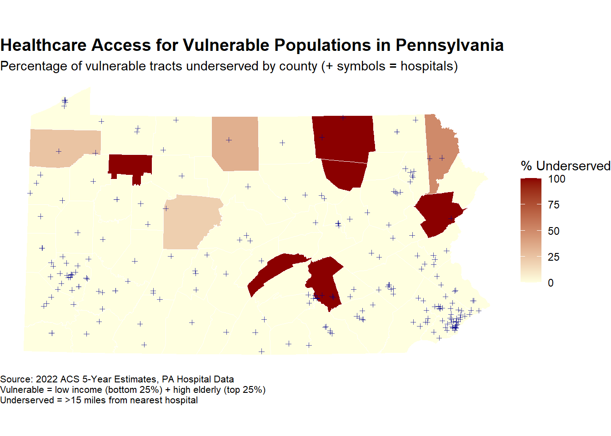
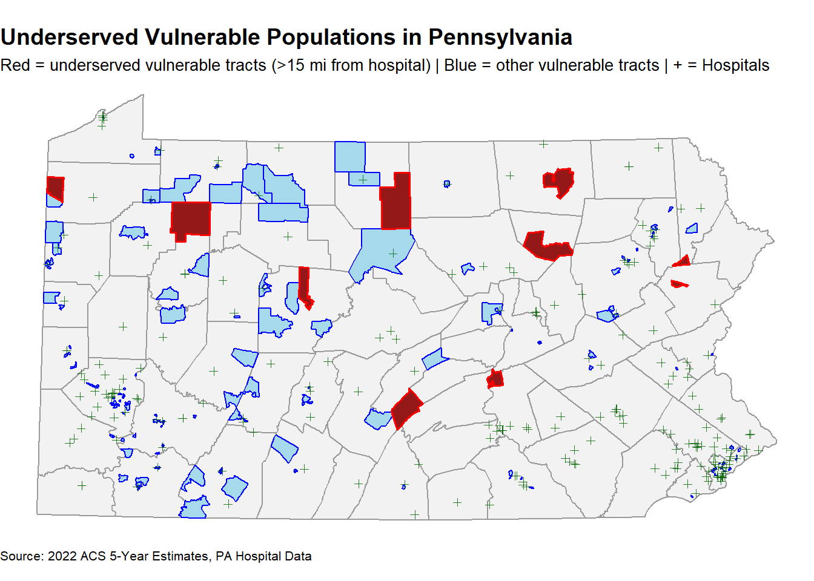
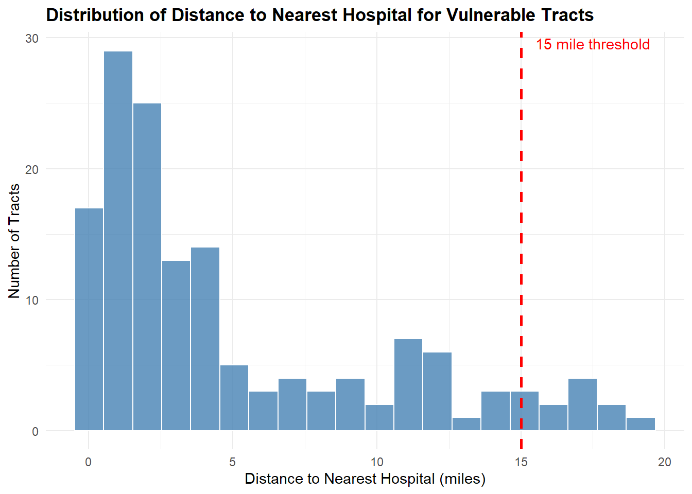
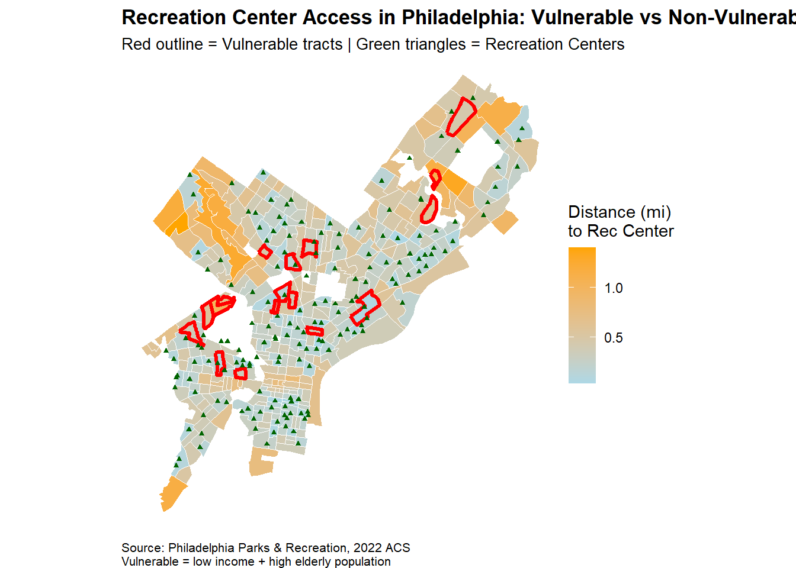

::: {.cell}

```{.r .cell-code}
# Add this near the top of your .qmd after loading libraries
options(tigris_use_cache = TRUE)
options(tigris_progress = FALSE)  # Suppress tigris progress bars
```
:::


## Assignment Overview

**Learning Objectives:**
- Apply spatial operations to answer policy-relevant research questions
- Integrate census demographic data with spatial analysis
- Create publication-quality visualizations and maps
- Work with spatial data from multiple sources
- Communicate findings effectively for policy audiences

---

## Part 1: Healthcare Access for Vulnerable Populations

### Research Question

**Which Pennsylvania counties have the highest proportion of vulnerable populations (elderly + low-income) living far from hospitals?**

Your analysis should identify counties that should be priorities for healthcare investment and policy intervention.

### Required Analysis Steps

Complete the following analysis, documenting each step with code and brief explanations:

#### Step 1: Data Collection (5 points)

Load the required spatial data:
- Pennsylvania county boundaries
- Pennsylvania hospitals (from lecture data)
- Pennsylvania census tracts

**Your Task:**


::: {.cell}

```{.r .cell-code}
# Load required packages
library(tidyverse)    
library(sf)           
library(tidycensus)   
library(tigris)       
```
:::


# Load spatial data

::: {.cell}

```{.r .cell-code}
# Pennsylvania county boundaries
pa_counties <- counties(state = "PA", cb = TRUE, year = 2022)
```

::: {.cell-output .cell-output-stdout}

```

  |                                                                            
  |                                                                      |   0%
  |                                                                            
  |                                                                      |   1%
  |                                                                            
  |=                                                                     |   1%
  |                                                                            
  |=                                                                     |   2%
  |                                                                            
  |==                                                                    |   2%
  |                                                                            
  |==                                                                    |   3%
  |                                                                            
  |==                                                                    |   4%
  |                                                                            
  |===                                                                   |   4%
  |                                                                            
  |===                                                                   |   5%
  |                                                                            
  |====                                                                  |   5%
  |                                                                            
  |====                                                                  |   6%
  |                                                                            
  |=====                                                                 |   6%
  |                                                                            
  |=====                                                                 |   7%
  |                                                                            
  |=====                                                                 |   8%
  |                                                                            
  |======                                                                |   8%
  |                                                                            
  |======                                                                |   9%
  |                                                                            
  |=======                                                               |   9%
  |                                                                            
  |=======                                                               |  10%
  |                                                                            
  |=======                                                               |  11%
  |                                                                            
  |========                                                              |  11%
  |                                                                            
  |========                                                              |  12%
  |                                                                            
  |=========                                                             |  12%
  |                                                                            
  |=========                                                             |  13%
  |                                                                            
  |==========                                                            |  14%
  |                                                                            
  |==========                                                            |  15%
  |                                                                            
  |===========                                                           |  15%
  |                                                                            
  |===========                                                           |  16%
  |                                                                            
  |============                                                          |  16%
  |                                                                            
  |============                                                          |  17%
  |                                                                            
  |============                                                          |  18%
  |                                                                            
  |=============                                                         |  18%
  |                                                                            
  |=============                                                         |  19%
  |                                                                            
  |==============                                                        |  19%
  |                                                                            
  |==============                                                        |  20%
  |                                                                            
  |==============                                                        |  21%
  |                                                                            
  |===============                                                       |  21%
  |                                                                            
  |===============                                                       |  22%
  |                                                                            
  |================                                                      |  22%
  |                                                                            
  |================                                                      |  23%
  |                                                                            
  |=================                                                     |  24%
  |                                                                            
  |=================                                                     |  25%
  |                                                                            
  |==================                                                    |  25%
  |                                                                            
  |==================                                                    |  26%
  |                                                                            
  |===================                                                   |  27%
  |                                                                            
  |===================                                                   |  28%
  |                                                                            
  |====================                                                  |  28%
  |                                                                            
  |====================                                                  |  29%
  |                                                                            
  |=====================                                                 |  29%
  |                                                                            
  |=====================                                                 |  30%
  |                                                                            
  |=====================                                                 |  31%
  |                                                                            
  |======================                                                |  31%
  |                                                                            
  |======================                                                |  32%
  |                                                                            
  |=======================                                               |  32%
  |                                                                            
  |=======================                                               |  33%
  |                                                                            
  |========================                                              |  34%
  |                                                                            
  |========================                                              |  35%
  |                                                                            
  |=========================                                             |  35%
  |                                                                            
  |=========================                                             |  36%
  |                                                                            
  |==========================                                            |  37%
  |                                                                            
  |==========================                                            |  38%
  |                                                                            
  |===========================                                           |  38%
  |                                                                            
  |===========================                                           |  39%
  |                                                                            
  |============================                                          |  39%
  |                                                                            
  |============================                                          |  40%
  |                                                                            
  |============================                                          |  41%
  |                                                                            
  |=============================                                         |  41%
  |                                                                            
  |=============================                                         |  42%
  |                                                                            
  |==============================                                        |  42%
  |                                                                            
  |==============================                                        |  43%
  |                                                                            
  |==============================                                        |  44%
  |                                                                            
  |===============================                                       |  44%
  |                                                                            
  |===============================                                       |  45%
  |                                                                            
  |================================                                      |  45%
  |                                                                            
  |================================                                      |  46%
  |                                                                            
  |=================================                                     |  47%
  |                                                                            
  |=================================                                     |  48%
  |                                                                            
  |==================================                                    |  48%
  |                                                                            
  |==================================                                    |  49%
  |                                                                            
  |===================================                                   |  49%
  |                                                                            
  |===================================                                   |  50%
  |                                                                            
  |===================================                                   |  51%
  |                                                                            
  |====================================                                  |  51%
  |                                                                            
  |====================================                                  |  52%
  |                                                                            
  |=====================================                                 |  52%
  |                                                                            
  |=====================================                                 |  53%
  |                                                                            
  |=====================================                                 |  54%
  |                                                                            
  |======================================                                |  54%
  |                                                                            
  |======================================                                |  55%
  |                                                                            
  |=======================================                               |  55%
  |                                                                            
  |=======================================                               |  56%
  |                                                                            
  |========================================                              |  56%
  |                                                                            
  |========================================                              |  57%
  |                                                                            
  |========================================                              |  58%
  |                                                                            
  |=========================================                             |  58%
  |                                                                            
  |=========================================                             |  59%
  |                                                                            
  |==========================================                            |  59%
  |                                                                            
  |==========================================                            |  60%
  |                                                                            
  |==========================================                            |  61%
  |                                                                            
  |===========================================                           |  61%
  |                                                                            
  |===========================================                           |  62%
  |                                                                            
  |============================================                          |  62%
  |                                                                            
  |============================================                          |  63%
  |                                                                            
  |============================================                          |  64%
  |                                                                            
  |=============================================                         |  64%
  |                                                                            
  |=============================================                         |  65%
  |                                                                            
  |==============================================                        |  65%
  |                                                                            
  |==============================================                        |  66%
  |                                                                            
  |===============================================                       |  66%
  |                                                                            
  |===============================================                       |  67%
  |                                                                            
  |===============================================                       |  68%
  |                                                                            
  |================================================                      |  68%
  |                                                                            
  |================================================                      |  69%
  |                                                                            
  |=================================================                     |  69%
  |                                                                            
  |=================================================                     |  70%
  |                                                                            
  |=================================================                     |  71%
  |                                                                            
  |==================================================                    |  71%
  |                                                                            
  |==================================================                    |  72%
  |                                                                            
  |===================================================                   |  72%
  |                                                                            
  |===================================================                   |  73%
  |                                                                            
  |====================================================                  |  74%
  |                                                                            
  |====================================================                  |  75%
  |                                                                            
  |=====================================================                 |  75%
  |                                                                            
  |=====================================================                 |  76%
  |                                                                            
  |======================================================                |  76%
  |                                                                            
  |======================================================                |  77%
  |                                                                            
  |======================================================                |  78%
  |                                                                            
  |=======================================================               |  78%
  |                                                                            
  |=======================================================               |  79%
  |                                                                            
  |========================================================              |  79%
  |                                                                            
  |========================================================              |  80%
  |                                                                            
  |========================================================              |  81%
  |                                                                            
  |=========================================================             |  81%
  |                                                                            
  |=========================================================             |  82%
  |                                                                            
  |==========================================================            |  82%
  |                                                                            
  |==========================================================            |  83%
  |                                                                            
  |===========================================================           |  84%
  |                                                                            
  |===========================================================           |  85%
  |                                                                            
  |============================================================          |  85%
  |                                                                            
  |============================================================          |  86%
  |                                                                            
  |=============================================================         |  87%
  |                                                                            
  |=============================================================         |  88%
  |                                                                            
  |==============================================================        |  88%
  |                                                                            
  |==============================================================        |  89%
  |                                                                            
  |===============================================================       |  89%
  |                                                                            
  |===============================================================       |  90%
  |                                                                            
  |===============================================================       |  91%
  |                                                                            
  |================================================================      |  91%
  |                                                                            
  |================================================================      |  92%
  |                                                                            
  |=================================================================     |  92%
  |                                                                            
  |=================================================================     |  93%
  |                                                                            
  |==================================================================    |  94%
  |                                                                            
  |==================================================================    |  95%
  |                                                                            
  |===================================================================   |  95%
  |                                                                            
  |===================================================================   |  96%
  |                                                                            
  |====================================================================  |  97%
  |                                                                            
  |====================================================================  |  98%
  |                                                                            
  |===================================================================== |  98%
  |                                                                            
  |===================================================================== |  99%
  |                                                                            
  |======================================================================|  99%
  |                                                                            
  |======================================================================| 100%
```


:::

```{.r .cell-code}
# Pennsylvania hospitals (from lecture data)
hospitals <- st_read("data/hospitals.geojson")
```

::: {.cell-output .cell-output-stdout}

```
Reading layer `hospitals' from data source 
  `C:\Users\16468\OneDrive - PennO365\Documents\Academics\MUSA\Public_Policy_Analytics\portfolio-setup-ssen-droid\Assignments\Assignment_2\data\hospitals.geojson' 
  using driver `GeoJSON'
Simple feature collection with 223 features and 11 fields
Geometry type: POINT
Dimension:     XY
Bounding box:  xmin: -80.49621 ymin: 39.75163 xmax: -74.86704 ymax: 42.13403
Geodetic CRS:  WGS 84
```


:::

```{.r .cell-code}
# Pennsylvania census tracts
pa_tracts <- tracts(state = "PA", cb = TRUE, year = 2022)
```

::: {.cell-output .cell-output-stdout}

```

  |                                                                            
  |                                                                      |   0%
  |                                                                            
  |=                                                                     |   1%
  |                                                                            
  |=                                                                     |   2%
  |                                                                            
  |==                                                                    |   3%
  |                                                                            
  |===                                                                   |   4%
  |                                                                            
  |===                                                                   |   5%
  |                                                                            
  |====                                                                  |   6%
  |                                                                            
  |=====                                                                 |   7%
  |                                                                            
  |=====                                                                 |   8%
  |                                                                            
  |======                                                                |   9%
  |                                                                            
  |=======                                                               |  10%
  |                                                                            
  |========                                                              |  11%
  |                                                                            
  |========                                                              |  12%
  |                                                                            
  |=========                                                             |  13%
  |                                                                            
  |==========                                                            |  14%
  |                                                                            
  |==========                                                            |  15%
  |                                                                            
  |===========                                                           |  16%
  |                                                                            
  |============                                                          |  17%
  |                                                                            
  |============                                                          |  18%
  |                                                                            
  |=============                                                         |  19%
  |                                                                            
  |==============                                                        |  20%
  |                                                                            
  |==============                                                        |  21%
  |                                                                            
  |===============                                                       |  22%
  |                                                                            
  |================                                                      |  23%
  |                                                                            
  |================                                                      |  24%
  |                                                                            
  |=================                                                     |  25%
  |                                                                            
  |==================                                                    |  26%
  |                                                                            
  |===================                                                   |  26%
  |                                                                            
  |===================                                                   |  27%
  |                                                                            
  |====================                                                  |  28%
  |                                                                            
  |=====================                                                 |  29%
  |                                                                            
  |=====================                                                 |  30%
  |                                                                            
  |======================                                                |  31%
  |                                                                            
  |=======================                                               |  32%
  |                                                                            
  |=======================                                               |  33%
  |                                                                            
  |========================                                              |  34%
  |                                                                            
  |=========================                                             |  35%
  |                                                                            
  |=========================                                             |  36%
  |                                                                            
  |==========================                                            |  37%
  |                                                                            
  |===========================                                           |  38%
  |                                                                            
  |===========================                                           |  39%
  |                                                                            
  |============================                                          |  40%
  |                                                                            
  |=============================                                         |  41%
  |                                                                            
  |==============================                                        |  42%
  |                                                                            
  |==============================                                        |  43%
  |                                                                            
  |===============================                                       |  44%
  |                                                                            
  |================================                                      |  45%
  |                                                                            
  |================================                                      |  46%
  |                                                                            
  |=================================                                     |  47%
  |                                                                            
  |==================================                                    |  48%
  |                                                                            
  |==================================                                    |  49%
  |                                                                            
  |===================================                                   |  50%
  |                                                                            
  |====================================                                  |  51%
  |                                                                            
  |====================================                                  |  52%
  |                                                                            
  |=====================================                                 |  53%
  |                                                                            
  |======================================                                |  54%
  |                                                                            
  |======================================                                |  55%
  |                                                                            
  |=======================================                               |  56%
  |                                                                            
  |========================================                              |  57%
  |                                                                            
  |=========================================                             |  58%
  |                                                                            
  |=========================================                             |  59%
  |                                                                            
  |==========================================                            |  60%
  |                                                                            
  |===========================================                           |  61%
  |                                                                            
  |===========================================                           |  62%
  |                                                                            
  |============================================                          |  63%
  |                                                                            
  |=============================================                         |  64%
  |                                                                            
  |=============================================                         |  65%
  |                                                                            
  |==============================================                        |  66%
  |                                                                            
  |===============================================                       |  67%
  |                                                                            
  |===============================================                       |  68%
  |                                                                            
  |================================================                      |  69%
  |                                                                            
  |=================================================                     |  70%
  |                                                                            
  |=================================================                     |  71%
  |                                                                            
  |==================================================                    |  72%
  |                                                                            
  |===================================================                   |  73%
  |                                                                            
  |===================================================                   |  74%
  |                                                                            
  |====================================================                  |  75%
  |                                                                            
  |=====================================================                 |  76%
  |                                                                            
  |======================================================                |  77%
  |                                                                            
  |=======================================================               |  78%
  |                                                                            
  |========================================================              |  79%
  |                                                                            
  |========================================================              |  80%
  |                                                                            
  |=========================================================             |  81%
  |                                                                            
  |==========================================================            |  82%
  |                                                                            
  |==========================================================            |  83%
  |                                                                            
  |===========================================================           |  84%
  |                                                                            
  |============================================================          |  85%
  |                                                                            
  |============================================================          |  86%
  |                                                                            
  |=============================================================         |  87%
  |                                                                            
  |==============================================================        |  88%
  |                                                                            
  |==============================================================        |  89%
  |                                                                            
  |===============================================================       |  90%
  |                                                                            
  |================================================================      |  91%
  |                                                                            
  |=================================================================     |  92%
  |                                                                            
  |=================================================================     |  93%
  |                                                                            
  |==================================================================    |  94%
  |                                                                            
  |===================================================================   |  95%
  |                                                                            
  |===================================================================   |  96%
  |                                                                            
  |====================================================================  |  97%
  |                                                                            
  |===================================================================== |  98%
  |                                                                            
  |===================================================================== |  99%
  |                                                                            
  |======================================================================| 100%
```


:::
:::


# Check that all data loaded correctly

::: {.cell}

```{.r .cell-code}
# Check that all data loaded correctly
# Check basic structure and CRS

print("PA Counties:")
```

::: {.cell-output .cell-output-stdout}

```
[1] "PA Counties:"
```


:::

```{.r .cell-code}
print(paste("Number of counties:", nrow(pa_counties)))  # Counts PA counties 
```

::: {.cell-output .cell-output-stdout}

```
[1] "Number of counties: 67"
```


:::

```{.r .cell-code}
print(paste("CRS:", st_crs(pa_counties)$input))        # Shows coordinate system for counties
```

::: {.cell-output .cell-output-stdout}

```
[1] "CRS: NAD83"
```


:::

```{.r .cell-code}
print("Hospitals:")
```

::: {.cell-output .cell-output-stdout}

```
[1] "Hospitals:"
```


:::

```{.r .cell-code}
print(paste("Number of hospitals:", nrow(hospitals)))   # Counts hospitals in the dataset
```

::: {.cell-output .cell-output-stdout}

```
[1] "Number of hospitals: 223"
```


:::

```{.r .cell-code}
print(paste("CRS:", st_crs(hospitals)$input))          # Shows coordinate system for hospitals
```

::: {.cell-output .cell-output-stdout}

```
[1] "CRS: WGS 84"
```


:::

```{.r .cell-code}
print("PA Census Tracts:")
```

::: {.cell-output .cell-output-stdout}

```
[1] "PA Census Tracts:"
```


:::

```{.r .cell-code}
print(paste("Number of census tracts:", nrow(pa_tracts)))  # Counts census tracts (should be ~3,000+)
```

::: {.cell-output .cell-output-stdout}

```
[1] "Number of census tracts: 3445"
```


:::

```{.r .cell-code}
print(paste("CRS:", st_crs(pa_tracts)$input))             # Shows coordinate system for tracts
```

::: {.cell-output .cell-output-stdout}

```
[1] "CRS: NAD83"
```


:::
:::


---

#### Step 2: Get Demographic Data 

Use `tidycensus` to download tract-level demographic data for Pennsylvania.

**Required variables:**
- Total population
- Median household income
- Population 65 years and over (you may need to sum multiple age categories)

**Your Task:**

::: {.cell}

```{.r .cell-code}
# Get demographic data from ACS

# Get tract-level demographic data for Pennsylvania
# Get the elderly population data
# We need to sum multiple age categories to get total 65+ population
pa_demographics_corrected <- get_acs(
  geography = "tract",
  variables = c(
    total_pop = "B01003_001",           # Total population
    median_income = "B19013_001",       # Median household income
    # Age 65-69
    age_65_69_male = "B01001_020",      # Male 65-69
    age_65_69_female = "B01001_044",    # Female 65-69
    # Age 70-74
    age_70_74_male = "B01001_021",      # Male 70-74
    age_70_74_female = "B01001_045",    # Female 70-74
    # Age 75-79
    age_75_79_male = "B01001_022",      # Male 75-79
    age_75_79_female = "B01001_046",    # Female 75-79
    # Age 80-84
    age_80_84_male = "B01001_023",      # Male 80-84
    age_80_84_female = "B01001_047",    # Female 80-84
    # Age 85+
    age_85_plus_male = "B01001_024",    # Male 85+
    age_85_plus_female = "B01001_048"   # Female 85+
  ),
  state = "PA",
  year = 2022,
  output = "wide"
)

# Calculate total population 65+
pa_demographics_corrected <- pa_demographics_corrected %>%
  mutate(
    pop_65_plus_total = age_65_69_maleE + age_65_69_femaleE + 
                        age_70_74_maleE + age_70_74_femaleE +
                        age_75_79_maleE + age_75_79_femaleE +
                        age_80_84_maleE + age_80_84_femaleE +
                        age_85_plus_maleE + age_85_plus_femaleE
  )

# Join to tract boundaries
pa_tracts_with_data <- pa_tracts %>%
  left_join(pa_demographics_corrected, by = "GEOID")
```
:::


::: {.cell}

```{.r .cell-code}
# Question 1: What year of ACS data are you using?
print("Question 1: What year of ACS data are you using?")
```

::: {.cell-output .cell-output-stdout}

```
[1] "Question 1: What year of ACS data are you using?"
```


:::

```{.r .cell-code}
print("Answer: 2022 (we specified year = 2022 in get_acs())")
```

::: {.cell-output .cell-output-stdout}

```
[1] "Answer: 2022 (we specified year = 2022 in get_acs())"
```


:::

```{.r .cell-code}
# Question 2: How many tracts have missing income data?
print("Question 2: How many tracts have missing income data?")
```

::: {.cell-output .cell-output-stdout}

```
[1] "Question 2: How many tracts have missing income data?"
```


:::

```{.r .cell-code}
missing_income <- sum(is.na(pa_tracts_with_data$median_incomeE))
print(paste("Answer:", missing_income, "tracts have missing income data"))
```

::: {.cell-output .cell-output-stdout}

```
[1] "Answer: 62 tracts have missing income data"
```


:::

```{.r .cell-code}
# Question 3: What is the median income across all PA census tracts?
print("Question 3: What is the median income across all PA census tracts?")
```

::: {.cell-output .cell-output-stdout}

```
[1] "Question 3: What is the median income across all PA census tracts?"
```


:::

```{.r .cell-code}
overall_median_income <- median(pa_tracts_with_data$median_incomeE, na.rm = TRUE)
print(paste("Answer: $", round(overall_median_income, 0), "is the median income across all PA tracts"))
```

::: {.cell-output .cell-output-stdout}

```
[1] "Answer: $ 70188 is the median income across all PA tracts"
```


:::
:::


---

#### Step 3: Define Vulnerable Populations 

Identify census tracts with vulnerable populations based on TWO criteria:
1. Low median household income (choose an appropriate threshold)
2. Significant elderly population (choose an appropriate threshold)


::: {.cell}

```{.r .cell-code}
# Define vulnerable populations using quartile approach
vulnerable_tracts <- pa_tracts_with_data %>%
  mutate(
    pct_elderly = (pop_65_plus_total / total_popE) * 100,
    low_income = median_incomeE < 55924,           # Bottom quartile
    high_elderly = pct_elderly >= 20.1,            # Top quartile
    vulnerable = low_income & high_elderly
  ) %>%
  filter(!is.na(median_incomeE))

print(paste("Vulnerable tracts:", sum(vulnerable_tracts$vulnerable, na.rm = TRUE)))
```

::: {.cell-output .cell-output-stdout}

```
[1] "Vulnerable tracts: 148"
```


:::

```{.r .cell-code}
print(paste("Percentage:", round(sum(vulnerable_tracts$vulnerable, na.rm = TRUE) / nrow(vulnerable_tracts) * 100, 2), "%"))
```

::: {.cell-output .cell-output-stdout}

```
[1] "Percentage: 4.37 %"
```


:::
:::


::: {.cell}

```{.r .cell-code}
# Check the quartiles of each category
summary(vulnerable_tracts$median_incomeE)
```

::: {.cell-output .cell-output-stdout}

```
   Min. 1st Qu.  Median    Mean 3rd Qu.    Max. 
  11558   55924   70188   77527   93287  250001 
```


:::

```{.r .cell-code}
summary(vulnerable_tracts$pct_elderly)
```

::: {.cell-output .cell-output-stdout}

```
   Min. 1st Qu.  Median    Mean 3rd Qu.    Max. 
   0.00   12.49   16.53   16.54   20.11   63.07 
```


:::
:::


**Questions to answer:**

Income Threshold: I chose a median household income threshold of $55,924, representing the first quartile (bottom 25%) of income distribution across Pennsylvania census tracts. Elderly Population Threshold: I selected 20.1% as the threshold for significant elderly population, representing the third quartile (top 25%) of elderly population distribution. These quartile-based thresholds were chosen to identify the most vulnerable populations given limited city resources for healthcare investment. By focusing on tracts in both the bottom quartile for income and the top quartile for elderly population, we ensure that our analysis prioritizes areas with the greatest need—where financial barriers to healthcare access coincide with high concentrations of elderly residents who face increased healthcare needs. Results: Using these criteria, 148 census tracts representing 4.37% of Pennsylvania census tracts meet both vulnerability criteria. This focused approach allows policymakers to target resources toward communities where vulnerable populations are most concentrated.

---

#### Step 4: Calculate Distance to Hospitals 

For each vulnerable tract, calculate the distance to the nearest hospital.


::: {.cell}

```{.r .cell-code}
# Transform to Pennsylvania South State Plane (EPSG:3365)
pa_counties_projected <- pa_counties %>%
  st_transform(crs = 3365)

hospitals_projected <- hospitals %>%
  st_transform(crs = 3365)

# Filter to vulnerable tracts and transform
vulnerable_tracts_projected <- vulnerable_tracts %>%
  filter(vulnerable == TRUE) %>%
  st_transform(crs = 3365)
```
:::


::: {.cell}

```{.r .cell-code}
# Calculate distance from each vulnerable tract centroid to nearest hospital
vulnerable_tract_centroids <- vulnerable_tracts_projected %>%
  st_centroid()

vulnerable_distances <- st_distance(vulnerable_tract_centroids, hospitals_projected)

vulnerable_tracts_projected <- vulnerable_tracts_projected %>%
  mutate(
    dist_to_hospital_ft = as.numeric(apply(vulnerable_distances, 1, min)),
    dist_to_hospital_mi = dist_to_hospital_ft / 5280
  )

# Summary statistics
avg_distance <- mean(vulnerable_tracts_projected$dist_to_hospital_mi, na.rm = TRUE)
print(paste("Average distance to nearest hospital:", round(avg_distance, 2), "miles"))
```

::: {.cell-output .cell-output-stdout}

```
[1] "Average distance to nearest hospital: 4.97 miles"
```


:::

```{.r .cell-code}
max_distance <- max(vulnerable_tracts_projected$dist_to_hospital_mi, na.rm = TRUE)
print(paste("Maximum distance:", round(max_distance, 2), "miles"))
```

::: {.cell-output .cell-output-stdout}

```
[1] "Maximum distance: 19.16 miles"
```


:::

```{.r .cell-code}
far_tracts <- sum(vulnerable_tracts_projected$dist_to_hospital_mi > 15, na.rm = TRUE)
print(paste("Vulnerable tracts more than 15 miles from hospital:", far_tracts))
```

::: {.cell-output .cell-output-stdout}

```
[1] "Vulnerable tracts more than 15 miles from hospital: 10"
```


:::
:::


**Run these two chunks and let me know what you get!**

**Summary:**
Projection Choice: I used Pennsylvania South State Plane (EPSG:3365) because it's optimized for accurate   distance measurements within Pennsylvania. Unlike geographic coordinates (latitude/longitude) which measure in degrees, this projected coordinate system uses feet, allowing us to calculate actual distances in miles.

- Average distance to nearest hospital: 4.97 miles  
- Maximum distance: 19.16 miles 
- # of vulnerable tracts 15< miles away from hospital: 10 

---

#### Step 5: Identify Underserved Areas 

Define "underserved" as vulnerable tracts that are more than 15 miles from the nearest hospital.


::: {.cell}

```{.r .cell-code}
# Create underserved variable
vulnerable_tracts_projected <- vulnerable_tracts_projected %>%
  mutate(
    underserved = dist_to_hospital_mi > 15
  )

# Summary statistics
underserved_count <- sum(vulnerable_tracts_projected$underserved, na.rm = TRUE)
print(paste("Underserved tracts:", underserved_count))
```

::: {.cell-output .cell-output-stdout}

```
[1] "Underserved tracts: 10"
```


:::

```{.r .cell-code}
pct_underserved <- (underserved_count / nrow(vulnerable_tracts_projected)) * 100
print(paste("Percentage of vulnerable tracts that are underserved:", round(pct_underserved, 2), "%"))
```

::: {.cell-output .cell-output-stdout}

```
[1] "Percentage of vulnerable tracts that are underserved: 6.76 %"
```


:::
:::

10 tracts are undeserved representing ~7% of the population. This number is slightly lower than I expected, as I would expected a higher proportion of undeserved populations to have limited access to hospitals; however, this still represents thousands of undeserved and extremely vulnerable individuals. It is possible that that these individuals are located in rural areas. Since a majority of the vulnerable population does live within 15 miles of hospitals, it is possible that they are located in more urban envirornments. In the next steps we will examine the spaital aspects of these findings. 

---

#### Step 6: Aggregate to County Level

Use spatial joins and aggregation to calculate county-level statistics about vulnerable populations and hospital access.

**Your Task:**

::: {.cell}

```{.r .cell-code}
# Spatial join to match vulnerable tracts to their counties
vulnerable_tracts_with_county <- vulnerable_tracts_projected %>%
  st_join(pa_counties_projected, join = st_within)
```
:::


# Aggregate statistics by county

::: {.cell}

```{.r .cell-code}
# Aggregate statistics by county
county_summary <- vulnerable_tracts_with_county %>%
  st_drop_geometry() %>%
  group_by(NAMELSAD.y) %>%
  summarize(
    num_vulnerable_tracts = n(),
    num_underserved_tracts = sum(underserved, na.rm = TRUE),
    pct_underserved = (num_underserved_tracts / num_vulnerable_tracts) * 100,
    avg_distance_to_hospital = mean(dist_to_hospital_mi, na.rm = TRUE),
    total_vulnerable_pop = sum(total_popE, na.rm = TRUE)
  ) %>%
  arrange(desc(pct_underserved))

# Display results
print(county_summary)
```

::: {.cell-output .cell-output-stdout}

```
# A tibble: 47 × 6
   NAMELSAD.y       num_vulnerable_tracts num_underserved_tracts pct_underserved
   <chr>                            <int>                  <int>           <dbl>
 1 Bradford County                      1                      1           100  
 2 Dauphin County                       1                      1           100  
 3 Forest County                        1                      1           100  
 4 Juniata County                       1                      1           100  
 5 Monroe County                        1                      1           100  
 6 Sullivan County                      1                      1           100  
 7 Wayne County                         2                      1            50  
 8 Potter County                        3                      1            33.3
 9 Crawford County                      4                      1            25  
10 Clearfield Coun…                     5                      1            20  
# ℹ 37 more rows
# ℹ 2 more variables: avg_distance_to_hospital <dbl>,
#   total_vulnerable_pop <dbl>
```


:::
:::


**Required county-level statistics:**
- Number of vulnerable tracts
- Number of underserved tracts  
- Percentage of vulnerable tracts that are underserved
- Average distance to nearest hospital for vulnerable tracts
- Total vulnerable population


::: {.cell}

```{.r .cell-code}
# Top 5 counties by percentage of underserved vulnerable tracts
top_5_pct <- county_summary %>%
  arrange(desc(pct_underserved)) %>%
  head(5) %>%
  select(NAMELSAD.y, num_vulnerable_tracts, num_underserved_tracts, pct_underserved)

print("Top 5 counties by percentage of underserved vulnerable tracts:")
```

::: {.cell-output .cell-output-stdout}

```
[1] "Top 5 counties by percentage of underserved vulnerable tracts:"
```


:::

```{.r .cell-code}
print(top_5_pct)
```

::: {.cell-output .cell-output-stdout}

```
# A tibble: 5 × 4
  NAMELSAD.y      num_vulnerable_tracts num_underserved_tracts pct_underserved
  <chr>                           <int>                  <int>           <dbl>
1 Bradford County                     1                      1             100
2 Dauphin County                      1                      1             100
3 Forest County                       1                      1             100
4 Juniata County                      1                      1             100
5 Monroe County                       1                      1             100
```


:::
:::


The above table looks at the top 5 counties that have the highest percentage of underserved vulnerable tracts. However, this data isn't overwhelmingly telling of anything. It shows that the of the 1 vulnerable tract that each of these counties have, that tract is also underserved.These counties are likely somewhat rural, with the vulnerable population all clustered together in tract. 


::: {.cell}

```{.r .cell-code}
# Counties with most vulnerable people living far from hospitals
underserved_pop_by_county <- vulnerable_tracts_with_county %>%
  st_drop_geometry() %>%
  filter(underserved == TRUE) %>%
  group_by(NAMELSAD.y) %>%
  summarize(
    underserved_vulnerable_pop = sum(total_popE, na.rm = TRUE),
    num_underserved_tracts = n()
  ) %>%
  arrange(desc(underserved_vulnerable_pop)) %>%
  head(5)

print("Top 5 counties with most vulnerable people living far from hospitals:")
```

::: {.cell-output .cell-output-stdout}

```
[1] "Top 5 counties with most vulnerable people living far from hospitals:"
```


:::

```{.r .cell-code}
print(underserved_pop_by_county)
```

::: {.cell-output .cell-output-stdout}

```
# A tibble: 5 × 3
  NAMELSAD.y        underserved_vulnerable_pop num_underserved_tracts
  <chr>                                  <dbl>                  <int>
1 Bradford County                         5466                      1
2 Dauphin County                          4018                      1
3 Clearfield County                       3343                      1
4 Forest County                           2701                      1
5 Crawford County                         2536                      1
```


:::
:::


::: {.cell}

```{.r .cell-code}
# All counties with underserved vulnerable tracts
all_counties_underserved <- vulnerable_tracts_with_county %>%
  st_drop_geometry() %>%
  filter(underserved == TRUE) %>%
  group_by(NAMELSAD.y) %>%
  summarize(
    num_underserved_tracts = n(),
    underserved_vulnerable_pop = sum(total_popE, na.rm = TRUE)
  ) %>%
  left_join(
    county_summary %>% select(NAMELSAD.y, num_vulnerable_tracts),
    by = "NAMELSAD.y"
  ) %>%
  select(NAMELSAD.y, num_vulnerable_tracts, num_underserved_tracts, underserved_vulnerable_pop) %>%
  arrange(desc(underserved_vulnerable_pop))

print("All counties with underserved vulnerable tracts:")
```

::: {.cell-output .cell-output-stdout}

```
[1] "All counties with underserved vulnerable tracts:"
```


:::

```{.r .cell-code}
print(all_counties_underserved)
```

::: {.cell-output .cell-output-stdout}

```
# A tibble: 10 × 4
   NAMELSAD.y        num_vulnerable_tracts num_underserved_tracts
   <chr>                             <int>                  <int>
 1 Bradford County                       1                      1
 2 Dauphin County                        1                      1
 3 Clearfield County                     5                      1
 4 Forest County                         1                      1
 5 Crawford County                       4                      1
 6 Potter County                         3                      1
 7 Wayne County                          2                      1
 8 Juniata County                        1                      1
 9 Monroe County                         1                      1
10 Sullivan County                       1                      1
# ℹ 1 more variable: underserved_vulnerable_pop <dbl>
```


:::
:::


**Questions to answer:**
Several of the counties that have 1 underserved tract also have just 1 vulnerable. Many of these counties are rural, suggesting that a vulnerble tract (high elderly population and low income) is automatically considered underserved given the likely large distance between tracts in that rural county and hospitals. However, this is not always the case. For example, Dauphin County is right outside of Harrisburg and fairly urban, implying that the underserved tract there is likely on the very outskirts. 

Places like Clearfield and Crawford have several vulnerable tracts, but only one underserved tract. This makes sense given their mixed nature with small cities. While more of their tracts are considered vulnerable, a lower proportion are underserved given their urban nature and distance to hospitals. This phenonmenon of high levels of vulnerability and low levels of underserved populations in urban areas is most evidently observed in Philadelphia, which has 17 vulnerable tracts yet 0 underserved tracts. 


---


::: {.cell}

```{.r .cell-code}
# Top 10 counties by total vulnerable population
# Add population of underserved tracts
top_10_vulnerable <- county_summary %>%
  left_join(
    vulnerable_tracts_with_county %>%
      st_drop_geometry() %>%
      filter(underserved == TRUE) %>%
      group_by(NAMELSAD.y) %>%
      summarize(underserved_pop = sum(total_popE, na.rm = TRUE)),
    by = "NAMELSAD.y"
  ) %>%
  arrange(desc(total_vulnerable_pop)) %>%
  head(10)

print(top_10_vulnerable)
```

::: {.cell-output .cell-output-stdout}

```
# A tibble: 10 × 7
   NAMELSAD.y       num_vulnerable_tracts num_underserved_tracts pct_underserved
   <chr>                            <int>                  <int>           <dbl>
 1 Philadelphia Co…                    17                      0               0
 2 Allegheny County                    16                      0               0
 3 Fayette County                       7                      0               0
 4 Westmoreland Co…                    10                      0               0
 5 Clearfield Coun…                     5                      1              20
 6 Luzerne County                       7                      0               0
 7 Mercer County                        5                      0               0
 8 Cambria County                       6                      0               0
 9 Somerset County                      4                      0               0
10 Erie County                          3                      0               0
# ℹ 3 more variables: avg_distance_to_hospital <dbl>,
#   total_vulnerable_pop <dbl>, underserved_pop <dbl>
```


:::
:::


#### Step 7: Create Summary Table 

Create a professional table showing the top 10 priority counties for healthcare investment.

**Your Task:**

::: {.cell}

```{.r .cell-code}
# Create and format priority counties table

# Create top 10 priority counties table by vulnerable population
priority_counties <- county_summary %>%
  left_join(
    vulnerable_tracts_with_county %>%
      st_drop_geometry() %>%
      filter(underserved == TRUE) %>%
      group_by(NAMELSAD.y) %>%
      summarize(underserved_pop = sum(total_popE, na.rm = TRUE)),
    by = "NAMELSAD.y"
  ) %>%
  arrange(desc(total_vulnerable_pop)) %>%
  head(10) %>%
  select(NAMELSAD.y, num_vulnerable_tracts, num_underserved_tracts, 
         pct_underserved, avg_distance_to_hospital, total_vulnerable_pop, underserved_pop)

# Format and display table
library(knitr)
kable(priority_counties,
      col.names = c("County", "Vulnerable Tracts", "Underserved Tracts", 
                    "% Underserved", "Avg Distance (mi)", "Vulnerable Population", "Underserved Population"),
      digits = 2,
      format.args = list(big.mark = ","),
      caption = "Top 10 Priority Counties for Healthcare Investment (ranked by total vulnerable population)")
```

::: {.cell-output-display}


Table: Top 10 Priority Counties for Healthcare Investment (ranked by total vulnerable population)

|County              | Vulnerable Tracts| Underserved Tracts| % Underserved| Avg Distance (mi)| Vulnerable Population| Underserved Population|
|:-------------------|-----------------:|------------------:|-------------:|-----------------:|---------------------:|----------------------:|
|Philadelphia County |                17|                  0|             0|              0.83|                61,779|                     NA|
|Allegheny County    |                16|                  0|             0|              2.72|                35,215|                     NA|
|Fayette County      |                 7|                  0|             0|              2.92|                22,199|                     NA|
|Westmoreland County |                10|                  0|             0|              2.57|                21,513|                     NA|
|Clearfield County   |                 5|                  1|            20|             12.16|                19,828|                  3,343|
|Luzerne County      |                 7|                  0|             0|              3.04|                18,702|                     NA|
|Mercer County       |                 5|                  0|             0|              1.78|                16,686|                     NA|
|Cambria County      |                 6|                  0|             0|              4.97|                13,301|                     NA|
|Somerset County     |                 4|                  0|             0|              8.48|                11,454|                     NA|
|Erie County         |                 3|                  0|             0|              4.63|                10,511|                     NA|


:::
:::


**Requirements:**
- Use `knitr::kable()` or similar for formatting
- Include descriptive column names
- Format numbers appropriately (commas for population, percentages, etc.)
- Add an informative caption
- Sort by priority (you decide the metric)

---

## Part 2: Comprehensive Visualization 

Using the skills from Week 3 (Data Visualization), create publication-quality maps and charts.

### Map 1: County-Level Choropleth 

Create a choropleth map showing healthcare access challenges at the county level.

**Your Task:**

::: {.cell}

```{.r .cell-code}
# Create county-level access map
# Join county summary data to county spatial boundaries
# Filter out counties with no vulnerable tracts (to remove gray areas)
counties_for_map <- pa_counties_projected %>%
  left_join(county_summary, by = c("NAMELSAD" = "NAMELSAD.y")) %>%
  mutate(pct_underserved = ifelse(is.na(pct_underserved), 0, pct_underserved))

# Create the map
ggplot() +
  # County fill by percentage underserved
  geom_sf(data = counties_for_map, 
          aes(fill = pct_underserved), 
          color = "white", 
          size = 0.3) +
  # Hospital locations as points
  geom_sf(data = hospitals_projected, 
          color = "darkblue", 
          size = 1.2, 
          alpha = 0.7,
          shape = 3) +  # Shape 3 = plus sign (cross)
  # Color scheme
  scale_fill_gradient(low = "lightyellow", 
                      high = "darkred",
                      name = "% Underserved") +
  # Labels and theme
  labs(title = "Healthcare Access for Vulnerable Populations in Pennsylvania",
       subtitle = "Percentage of vulnerable tracts underserved by county (+ symbols = hospitals)",
       caption = "Source: 2022 ACS 5-Year Estimates, PA Hospital Data\nVulnerable = low income (bottom 25%) + high elderly (top 25%)\nUnderserved = >15 miles from nearest hospital") +
  theme_void() +
  theme(
    plot.title = element_text(size = 14, face = "bold"),
    plot.subtitle = element_text(size = 11),
    plot.caption = element_text(size = 8, hjust = 0),
    legend.position = "right"
  )
```

::: {.cell-output-display}
{width=672}
:::
:::

The above map shows the percent of vulnerable tracts that are underserved and the location of hospitals marked by the dark blue "+" symbols per the assignments instructions. As can be seen, these large counties have very few hospitals, with a 3 of them having no hospitals at all.

However, the map is somewhat misleading. Many of these counties only have 1 tract that is vulnerable. This map makes could be misleading in making it seem like these whole counties are vulnerable and underserved. 

---

### Map 2: Detailed Vulnerability Map 

Create a map highlighting underserved vulnerable tracts.

**Your Task:**

::: {.cell}

```{.r .cell-code}
# Map 2 with bolder vulnerable tracts
ggplot() +
  geom_sf(data = pa_counties_projected, 
          fill = "gray95", 
          color = "gray60", 
          size = 0.5) +
  geom_sf(data = vulnerable_tracts_projected %>% filter(vulnerable == TRUE, underserved == FALSE),
          fill = "skyblue",
          color = "blue",  # Add outline
          size = 0.5,
          alpha = 0.7) +
  geom_sf(data = vulnerable_tracts_projected %>% filter(underserved == TRUE),
          fill = "darkred",
          color = "red",
          size = 0.7,
          alpha = 0.9) +
  geom_sf(data = hospitals_projected,
          color = "darkgreen",
          size = 1.5,
          alpha = 0.8,
          shape = 3) +
  labs(title = "Underserved Vulnerable Populations in Pennsylvania",
       subtitle = "Red = underserved vulnerable tracts (>15 mi from hospital) | Blue = other vulnerable tracts | + = Hospitals",
       caption = "Source: 2022 ACS 5-Year Estimates, PA Hospital Data") +
  theme_void() +
  theme(
    plot.title = element_text(size = 14, face = "bold"),
    plot.subtitle = element_text(size = 10),
    plot.caption = element_text(size = 8, hjust = 0)
  )
```

::: {.cell-output-display}
{width=672}
:::
:::

The above map shows vulnerable tracts in light blue with a dark boarder, and vulnerable underserved tracts in dark red. As can be seen, none of the dark red tracts have a hospital in them. For Philadelphia, despite having many hospitals, there are still the highest number of vulnerable tracts. 


---


### Chart: Distribution Analysis

Create a visualization showing the distribution of distances to hospitals for vulnerable populations.


::: {.cell}

```{.r .cell-code}
# Create histogram showing distribution of distances to hospitals for vulnerable populations
ggplot(vulnerable_tracts_projected %>% filter(vulnerable == TRUE), 
       aes(x = dist_to_hospital_mi)) +
  geom_histogram(bins = 20, 
                 fill = "steelblue", 
                 color = "white", 
                 alpha = 0.8) +
  geom_vline(xintercept = 15, 
             linetype = "dashed", 
             color = "red", 
             size = 1) +
  annotate("text", 
           x = 15.5, 
           y = Inf, 
           label = "15 mile threshold", 
           vjust = 1.5, 
           hjust = 0, 
           color = "red") +
  labs(title = "Distribution of Distance to Nearest Hospital for Vulnerable Tracts",
       x = "Distance to Nearest Hospital (miles)",
       y = "Number of Tracts") +
  theme_minimal() +
  theme(
    plot.title = element_text(size = 13, face = "bold")
  )
```

::: {.cell-output-display}
{width=672}
:::
:::

The histogram above shows that a majority of vulnerable populations live within 10 miles of hospitals. With only a few living more than 15 miles away from a hospital, qualifying them as underserved. These populations are at a very high level of risk, but many other factors in addition to distance from a hospital can put vulnerable populations at risk. Of the top 10 counties with the highest vulnerable populations, one of the counties - Clearfield - has a tract that that is also underserved. 

**Suggested chart types:**
- Histogram or density plot of distances
- Box plot comparing distances across regions
- Bar chart of underserved tracts by county
- Scatter plot of distance vs. vulnerable population size

**Requirements:**
- Clear axes labels with units
- Appropriate title
- Professional formatting
- Brief interpretation (1-2 sentences as a caption or in text)

---

## Part 3: Bring Your Own Data Analysis 

Choose your own additional spatial dataset and conduct a supplementary analysis.

### Challenge Options

Choose ONE of the following challenge exercises, or propose your own research question using OpenDataPhilly data (https://opendataphilly.org/datasets/). 

**Note these are just loose suggestions to spark ideas - follow or make your own as the data permits and as your ideas evolve. This analysis should include bringing in your own dataset, ensuring the projection/CRS of your layers align and are appropriate for the analysis (not lat/long or geodetic coordinate systems). The analysis portion should include some combination of spatial and attribute operations to answer a relatively straightforward question**

---

#### Education & Youth Services

**Option A: Educational Desert Analysis**
- **Data:** Schools, Libraries, Recreation Centers, Census tracts (child population)
- **Question:** "Which neighborhoods lack adequate educational infrastructure for children?"
- **Operations:** Buffer schools/libraries (0.5 mile walking distance), identify coverage gaps, overlay with child population density
- **Policy relevance:** School district planning, library placement, after-school program siting

**Option B: School Safety Zones**
- **Data:** Schools, Crime Incidents, Bike Network
- **Question:** "Are school zones safe for walking/biking, or are they crime hotspots?"
- **Operations:** Buffer schools (1000ft safety zone), spatial join with crime incidents, assess bike infrastructure coverage
- **Policy relevance:** Safe Routes to School programs, crossing guard placement

---

#### Environmental Justice

**Option C: Green Space Equity** 
- **Data:** Parks, Street Trees, Census tracts (race/income demographics)
- **Question:** "Do low-income and minority neighborhoods have equitable access to green space?"
- **Operations:** Buffer parks (10-minute walk = 0.5 mile), calculate tree canopy or park acreage per capita, compare by demographics
- **Policy relevance:** Climate resilience, environmental justice, urban forestry investment
---

#### Public Safety & Justice

**Option D: Crime & Community Resources**
- **Data:** Crime Incidents, Recreation Centers, Libraries, Street Lights
- **Question:** "Are high-crime areas underserved by community resources?"
- **Operations:** Aggregate crime counts to census tracts or neighborhoods, count community resources per area, spatial correlation analysis
- **Policy relevance:** Community investment, violence prevention strategies
---

#### Infrastructure & Services

**Option E: Polling Place Accessibility**
- **Data:** Polling Places, SEPTA stops, Census tracts (elderly population, disability rates)
- **Question:** "Are polling places accessible for elderly and disabled voters?"
- **Operations:** Buffer polling places and transit stops, identify vulnerable populations, find areas lacking access
- **Policy relevance:** Voting rights, election infrastructure, ADA compliance

---

#### Health & Wellness

**Option F: Recreation & Population Health**
- **Data:** Recreation Centers, Playgrounds, Parks, Census tracts (demographics)
- **Question:** "Is lack of recreation access associated with vulnerable populations?"
- **Operations:** Calculate recreation facilities per capita by neighborhood, buffer facilities for walking access, overlay with demographic indicators
- **Policy relevance:** Public health investment, recreation programming, obesity prevention

---

#### Emergency Services

**Option G: EMS Response Coverage**
- **Data:** Fire Stations, EMS stations, Population density, High-rise buildings
- **Question:** "Are population-dense areas adequately covered by emergency services?"
- **Operations:** Create service area buffers (5-minute drive = ~2 miles), assess population coverage, identify gaps in high-density areas
- **Policy relevance:** Emergency preparedness, station siting decisions

---

#### Arts & Culture

**Option H: Cultural Asset Distribution**
- **Data:** Public Art, Museums, Historic sites/markers, Neighborhoods
- **Question:** "Do all neighborhoods have equitable access to cultural amenities?"
- **Operations:** Count cultural assets per neighborhood, normalize by population, compare distribution across demographic groups
- **Policy relevance:** Cultural equity, tourism, quality of life, neighborhood identity

---

### Data Sources

**OpenDataPhilly:** https://opendataphilly.org/datasets/
- Most datasets available as GeoJSON, Shapefile, or CSV with coordinates
- Always check the Metadata for a data dictionary of the fields.

**Additional Sources:**
- **Pennsylvania Open Data:** https://data.pa.gov/
- **Census Bureau (via tidycensus):** Demographics, economic indicators, commute patterns
- **TIGER/Line (via tigris):** Geographic boundaries

### Recommended Starting Points

**If you're feeling confident:** Choose an advanced challenge with multiple data layers. 
**If you are a beginner, choose something more manageable that helps you understand the basics**


**If you have a different idea:** Propose your own question! Just make sure:
- You can access the spatial data
- You can perform at least 2 spatial operations

### Your Analysis

**Your Task:**

1. **Find and load additional data**
   - Document your data source
   - Check and standardize the CRS
   - Provide basic summary statistics


::: {.cell}

```{.r .cell-code}
# Load recreation centers dataset
rec_centers <- st_read("data/PPR_Program_Sites.geojson")
```

::: {.cell-output .cell-output-stdout}

```
Reading layer `PPR_Program_Sites' from data source 
  `C:\Users\16468\OneDrive - PennO365\Documents\Academics\MUSA\Public_Policy_Analytics\portfolio-setup-ssen-droid\Assignments\Assignment_2\data\PPR_Program_Sites.geojson' 
  using driver `GeoJSON'
Simple feature collection with 171 features and 10 fields
Geometry type: POINT
Dimension:     XY
Bounding box:  xmin: -75.2563 ymin: 39.90444 xmax: -74.96944 ymax: 40.12284
Geodetic CRS:  WGS 84
```


:::

```{.r .cell-code}
# Check basic information
print(paste("Number of recreation centers:", nrow(rec_centers)))
```

::: {.cell-output .cell-output-stdout}

```
[1] "Number of recreation centers: 171"
```


:::

```{.r .cell-code}
print(paste("CRS:", st_crs(rec_centers)$input))
```

::: {.cell-output .cell-output-stdout}

```
[1] "CRS: WGS 84"
```


:::

```{.r .cell-code}
# Check what columns we have
names(rec_centers)
```

::: {.cell-output .cell-output-stdout}

```
 [1] "OBJECTID"     "PARK_NAME"    "DPP_ASSET_ID" "PROGRAM_TYPE" "SITE_CLASS"  
 [6] "BUILDING"     "GYM"          "LABEL_NUMBER" "COMMENTS"     "DATA_SOURCE" 
[11] "geometry"    
```


:::

```{.r .cell-code}
# View first few rows to understand the data
head(rec_centers)
```

::: {.cell-output .cell-output-stdout}

```
Simple feature collection with 6 features and 10 fields
Geometry type: POINT
Dimension:     XY
Bounding box:  xmin: -75.2563 ymin: 39.96572 xmax: -75.16713 ymax: 39.97446
Geodetic CRS:  WGS 84
  OBJECTID                          PARK_NAME DPP_ASSET_ID PROGRAM_TYPE
1      807 Tiffany Fletcher Recreation Center         1911      PPR_REC
2      808        Roberto Clemente Playground         1831      PPR_REC
3      809              Miles Mack Playground         1910      PPR_REC
4      810      William T Granahan Playground         1864      PPR_REC
5      811     Francisville Recreation Center         1859      PPR_REC
6      812          Charles A Papa Playground         1929      PPR_REC
  SITE_CLASS BUILDING GYM LABEL_NUMBER
1          A        Y   N         <NA>
2          B        Y   N         <NA>
3          A        Y   N         <NA>
4          B        Y   N         <NA>
5          A        Y   N         <NA>
6          A        Y   N         <NA>
                                                            COMMENTS
1 Former name Mill Creek Playground and Recreation Center (12/2022).
2                                                                   
3                                                                   
4                                    Located within Cobbs Creek Park
5                                                                   
6                                            Located in Morris Park.
     DATA_SOURCE                   geometry
1 Programs 11/24 POINT (-75.21582 39.96598)
2 Programs 11/24 POINT (-75.16794 39.96572)
3 Programs 11/24 POINT (-75.19562 39.96748)
4 Programs 11/24  POINT (-75.2504 39.96936)
5 Programs 11/24  POINT (-75.16713 39.9685)
6 Programs 11/24  POINT (-75.2563 39.97446)
```


:::
:::


I chose the Philadelphia Parks & Recreation (PPR) Program Sites dataset. This dataset contains recreation centers, playgrounds, and other youth-focused facilities operated by Philadelphia Parks & Recreation. I selected this dataset because recreation centers provide critical after-school programming, sports facilities, and community activities for children and youth, making them an important complement to the hospital access analysis from Part 1. This analysis will examine whether vulnerable populations (low-income elderly) live in areas that also lack youth educational and recreational resources.

Data source: OpenDataPhilly (Philadelphia Parks & Recreation Department). The dataset was last updated in November 2024 according to the "Programs 11/24" notation in the data source field.

The dataset contains 171 recreation facilities across Philadelphia.

The data is in WGS 84 (EPSG:4326), a geographic coordinate system. We will need to transform it (see below) to Pennsylvania South State Plane (EPSG:3365) to match the projected coordinate system used in Part 1 and enable accurate distance calculations in miles.


::: {.cell}

```{.r .cell-code}
# Transform recreation centers to Pennsylvania South State Plane (EPSG:3365)
rec_centers_projected <- rec_centers %>%
  st_transform(crs = 3365)

# Check that transformation worked
print(paste("Recreation centers CRS:", st_crs(rec_centers_projected)$input))
```

::: {.cell-output .cell-output-stdout}

```
[1] "Recreation centers CRS: EPSG:3365"
```


:::
:::

---

2. **Research question**

Do vulnerable populations in Philadelphia have adequate access to recreation centers compared to non-vulnerable populations? 

---

3. **Conduct spatial analysis**

Use at least TWO spatial operations to answer your research question.


::: {.cell}

```{.r .cell-code}
# Filter to Philadelphia County only using GEOID
# Philadelphia County FIPS code is 42101 (42 = PA, 101 = Philadelphia)
philly_tracts <- pa_tracts_with_data %>%
  filter(str_starts(GEOID, "42101")) %>%  # Filter for Philadelphia County
  st_transform(crs = 3365) %>%
  mutate(
    pct_elderly = (pop_65_plus_total / total_popE) * 100,
    low_income = median_incomeE < 55924,
    high_elderly = pct_elderly >= 20.1,
    vulnerable = low_income & high_elderly
  ) %>%
  filter(!is.na(median_incomeE))

# Check how many tracts we got
print(paste("Philadelphia tracts:", nrow(philly_tracts)))
```

::: {.cell-output .cell-output-stdout}

```
[1] "Philadelphia tracts: 383"
```


:::

```{.r .cell-code}
print(paste("Vulnerable tracts:", sum(philly_tracts$vulnerable, na.rm = TRUE)))
```

::: {.cell-output .cell-output-stdout}

```
[1] "Vulnerable tracts: 17"
```


:::

```{.r .cell-code}
print(paste("Non-vulnerable tracts:", sum(!philly_tracts$vulnerable, na.rm = TRUE)))
```

::: {.cell-output .cell-output-stdout}

```
[1] "Non-vulnerable tracts: 366"
```


:::
:::


::: {.cell}

```{.r .cell-code}
# Calculate distance for all Philadelphia tracts
philly_centroids <- st_centroid(philly_tracts)
distances_to_rec <- st_distance(philly_centroids, rec_centers_projected)

philly_tracts <- philly_tracts %>%
  mutate(
    dist_to_rec_ft = as.numeric(apply(distances_to_rec, 1, min)),
    dist_to_rec_mi = dist_to_rec_ft / 5280
  )
```
:::


::: {.cell}

```{.r .cell-code}
# Summary statistics by vulnerability status
access_comparison <- philly_tracts %>%
  st_drop_geometry() %>%
  group_by(vulnerable) %>%
  summarize(
    num_tracts = n(),
    avg_dist_to_rec = mean(dist_to_rec_mi, na.rm = TRUE),
    median_dist_to_rec = median(dist_to_rec_mi, na.rm = TRUE),
    pct_within_half_mile = sum(dist_to_rec_mi <= 0.5, na.rm = TRUE) / n() * 100
  )

print(access_comparison)
```

::: {.cell-output .cell-output-stdout}

```
# A tibble: 2 × 5
  vulnerable num_tracts avg_dist_to_rec median_dist_to_rec pct_within_half_mile
  <lgl>           <int>           <dbl>              <dbl>                <dbl>
1 FALSE             366           0.371              0.335                 80.1
2 TRUE               17           0.433              0.366                 70.6
```


:::
:::


::: {.cell}

```{.r .cell-code}
# Map showing distance colored, with vulnerable tracts outlined
ggplot() +
  # All tracts colored by distance
  geom_sf(data = philly_tracts,
          aes(fill = dist_to_rec_mi),
          color = "white",
          size = 0.2) +
  # Add thick border around vulnerable tracts
  geom_sf(data = philly_tracts %>% filter(vulnerable == TRUE),
          fill = NA,  # No fill, just outline
          color = "red",
          size = 1.2) +  # Thick red outline
  # Recreation centers - smaller triangles
  geom_sf(data = rec_centers_projected,
          color = "darkgreen",
          size = 1,  # Smaller size
          shape = 17) +
  scale_fill_gradient(low = "lightblue", high = "orange",
                      name = "Distance (mi)\nto Rec Center") +
  labs(title = "Recreation Center Access in Philadelphia: Vulnerable vs Non-Vulnerable Tracts",
       subtitle = "Red outline = Vulnerable tracts | Green triangles = Recreation Centers",
       caption = "Source: Philadelphia Parks & Recreation, 2022 ACS\nVulnerable = low income + high elderly population") +
  theme_void() +
  theme(
    plot.title = element_text(size = 13, face = "bold"),
    plot.subtitle = element_text(size = 10),
    plot.caption = element_text(size = 8, hjust = 0),
    legend.position = "right"
  )
```

::: {.cell-output-display}
{width=672}
:::
:::


**Interpretation:**

The analysis reveals modest disparities in recreation center access between vulnerable and non-vulnerable populations in Philadelphia. Vulnerable tracts are located an average of 0.43 miles from the nearest recreation center compared to 0.37 miles for non-vulnerable tracts, and only 70.6% of vulnerable tracts fall within a half-mile walking distance compared to 80.1% of non-vulnerable tracts. While these differences suggest that vulnerable populations may have slightly worse access to recreational facilities, further statistical testing would be necessary to determine whether these observed differences are statistically significant or could be attributed to random chance. 
A permutation test or similar randomization procedure would help establish whether the 0.06-mile average difference and the 9.5 percentage point gap in coverage represent meaningful disparities requiring policy intervention. Overall, both groups demonstrate relatively good access to recreation centers, with most Philadelphia tracts located within comfortable walking distance of these facilities.


## Finally - A few comments about your incorporation of feedback!
This time around I tried to format a little better and delete extraneous lines, such as "Your Task" and various instructions. I kept some of the instructions for ease of review as necessary. 


---

## Submission Requirements

**What to submit:**

1. **Rendered HTML document posted to your course portfolio** with all code, outputs, maps, and text
   - Use `embed-resources: true` in YAML so it's a single file
   - All code should run without errors
   - All maps and charts should display correctly

**File naming:** `LastName_FirstName_Assignment2.html` and `LastName_FirstName_Assignment2.qmd`

---


